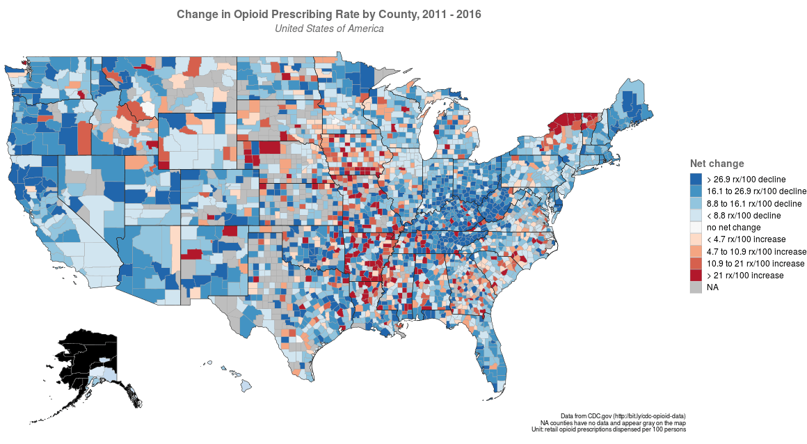
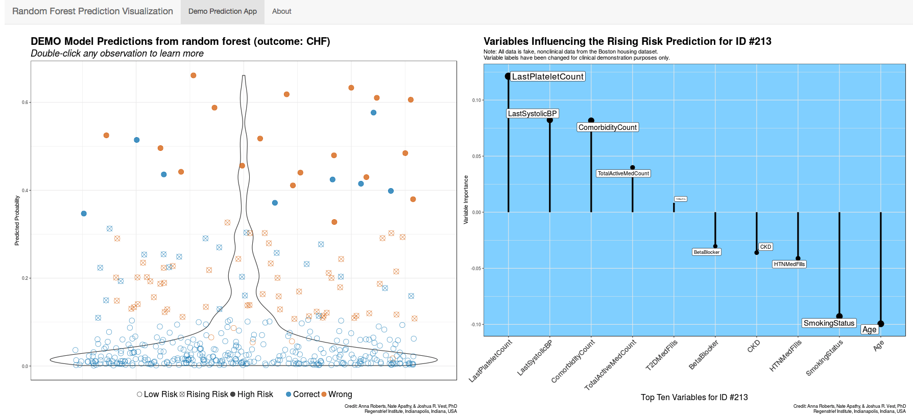

## woRdle
`in development`

## Economics Seminar Speaker Diversity

Jennifer Doleac (Texas A&M) and Elizabeth Pancotti along with a team of undergraduate assistants have collected years of historical data on invited speakers for economics department seminars at universities across the US. Invited seminars serve an important role in academic economists' career trajectories, so they wanted to better understand the racial and gender composition of seminar speakers in aggregate, within specific departments, and within specific seminar series (e.g. labor economics or health economics). We collaborated to build an [R Shiny Dashboard for visualizing trends of women speakers and under-represented minorities](https://econseminardiversity.shinyapps.io/EconSeminarDiversity/). You can even compare universities and specific lecture series over time! More data is being added regularly, so keep checking in on this important project.

## Opioid Prescribing Rate Visualizations

In 2018, the Centers for Disease Control and Prevention released data on [opioid prescribing rates](https://www.cdc.gov/drugoverdose/maps/rxrate-maps.html) at the county and state levels for 2006 through 2016. [Kevin Wiley](https://fsph.iupui.edu/about/directory/wiley-kevin.html) and I developed a [Shiny app](https://natea.shinyapps.io/opioid_rx_rate/) to visualize changes in prescribing rates over time. This app expands on the CDC data by allowing users to define regions and time frames for comparison. For more information, see this blog post.

## CHF Risk Prediction Tool (Demo)

Working with a team of collaborators from the Regenstrief Institute, we constructed a random forest risk prediction model for congestive heart failure (CHF). We then built an [application](https://natea.shinyapps.io/rf_plot_app/), leveraging RShiny and ggplot2, to visualize both population-level risk prediction (left) and the factors influencing individual patients' risk predictions (right). This allows users to see not only an overall risk prediction but also the unique factors driving each patient's predicted risk. The "individual patient" plot on the right dynamically updates when the user clicks on any point in the "population" plot on the left.
